<a href="README.md"></a>
<a href="README_RU.md"></a> 

# Большие часы BIM32
## Часы на ESP32 и светодиодах WS2812b

<p align="center">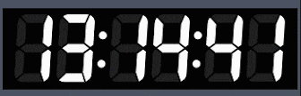</p> 

Часы на ESP32 и светодиодах WS2812b. Практически все детали часов напечатаны на 3д принтере. Размеры 38х12см. Часы состоят из множества небольших деталей, самая большая из них имеет длину 16см, то есть, всё можно напечатать практически на любом 3д принтере.

### Краткий список возможностей часов:

* Подключение к домашней WiFi сети 2.4 гГц
* Синхронизация часов с NTP сервером
* Отображение текущей погоды (температура/давление/влажность)
* Отображение температуры, влажности, уровня CO2 и качества воздуха в доме
* Управление погодой в доме (увлажнителем, осушителем, обогревателем, охладителем и очистителем воздуха)
* Отправка и/или прием данных с/на сервис thingspeak
* Отправка данных на народный мониторинг
* До 2х беспроводных датчиков температуры/давления/влажности/CO2/освещенности/напряжения/тока/мощности/потребленной энергии
* Поддержка проводных датчиков температуры/давления/влажности/освещенности/качества воздуха
* Авторегулировка яркости подсветки экрана (по датчику освещенности, по времени, или по факту рассвета и заката)
* Возможность подключить второй дисплей
* Говорящие часы
* Будильник воспроизводящий mp3 файлы
* Звуковое оповещение о выходе температуры, влажности, CO2 и качества воздуха за пределы комфорта
* Очень гибкие настройки через веб интерфейс

## Схема подключения дисплея
Для запуска и работы часов достаточно соединить **дисплей** с **ESP32**. Подключение всех остальных модулей является необязательным. 

Выкладываю вместо схем полурисунки-полуфотографии, чтоб было понятно и начинающим и даже непрофессионалам. Профессионалов прошу не расстраиваться, нормальные схемы тоже будут.

Дисплей состоит из шести, или четырех цифр, каждая цифра состоит из 7 сегментов, сегменты подключены друг за другом последовательно, в каждом сементе могут быть от одного до трех подключенных последовательно светодиодов WS2812b. Между каждой парой цифр по 2 разделительные точки, в каждой точке только по одному светодиоду.

Для согласования уровней сигнала (3.3в выход ESP32 и 5в вход светодиодов WS2812b) применен "жертвенный" светодиод, питание которого подключено через диод, прямое падение напряжения на котором составляет примерно 0.6в

<p align="center">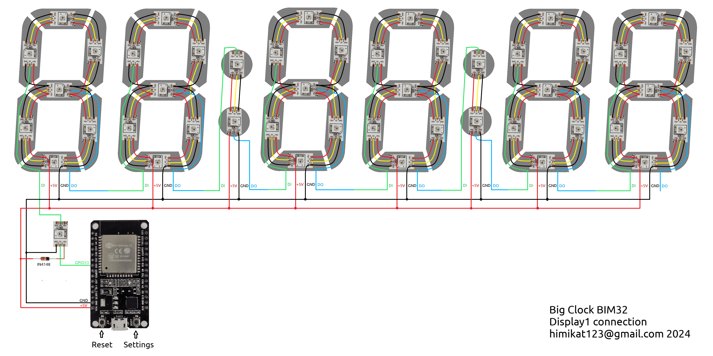</p> 

Дополнительно, можно подключить второй дисплей, по следующей схеме:

<p align="center">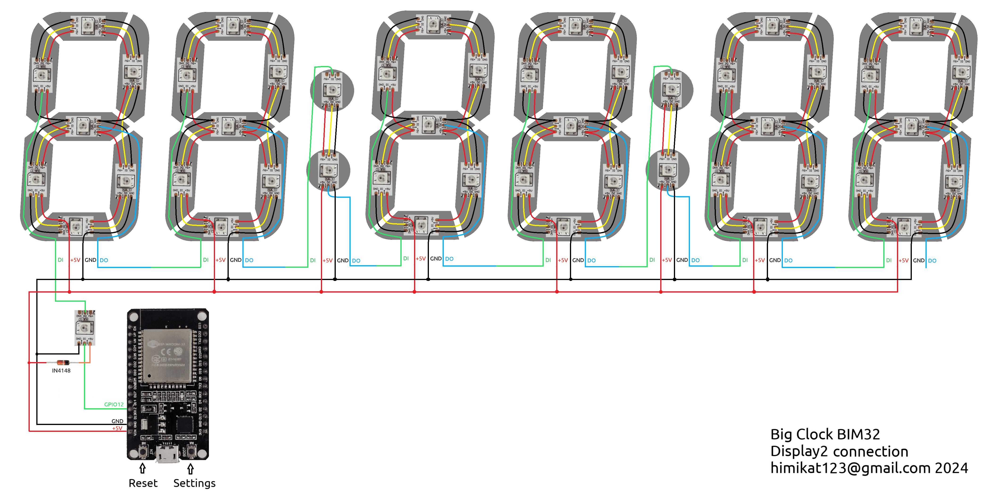</p> 

Если вдруг, кому нужно иметь под рукой кнопку (кнопки) включения/выключения дисплея (дисплеев), ее (их) можно подключить по следующей схеме.

<p align="center">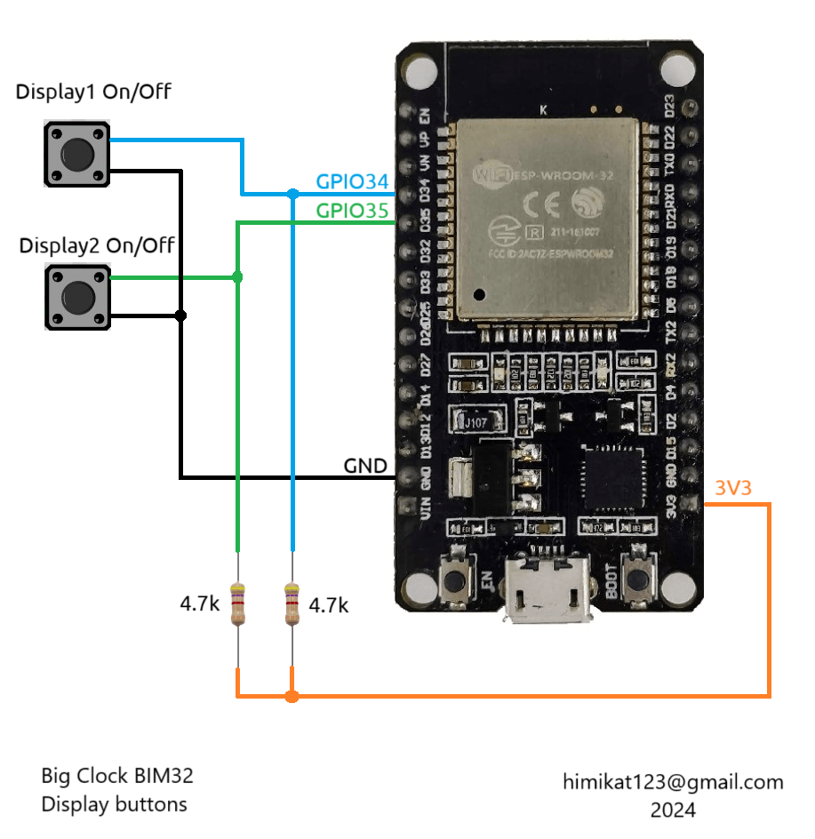</p>

## Схема подключения проводных датчиков к часам
К **часам** можно подключить проводные датчики температуры, влажности, давления, качества воздуха и уровня освещенности. **Часы** поддерживают следующие датчики: 
* BME280
* BME680
* BMP180
* SHT21
* DHT22
* DS18B20
* MAX44009
* BH1750
* фоторезистор

Можно подключить любой один, несколько, либо сразу все датчики из этого списка. Также, рекомендуется установить микросхему часов реального времени DS3231, хотя, это вовсе не обязательно. Схема подключения следующая.

<p align="center">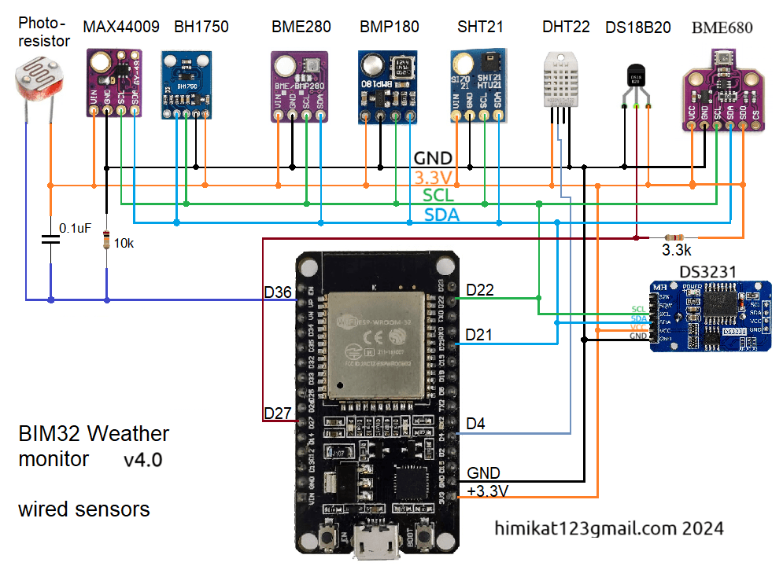</p>

## Схема подключения модуля радиоканала для связи с беспроводными датчиками
Также, к **часам** можно подключить **[беспроводные датчики](https://github.com/himikat123/Radio-sensor)**, для этого нужно добавить модуль радиоканала **HC-12** по приведенной ниже схеме.

<p align="center"></p>

## Схема подключения приборов управления погодой в доме
Для управления погодой в доме можно подключить увлажнитель и осушитель воздуха, а также обогреватель, охладитель (вентилятор или кондиционер) и очиститель воздуха. Схему подключения этих приборов привести не могу, так как все зависит от того как реализовано управление в каждом конкретном приборе (пультом, кнопками, напряжением). Поэтому просто обозначу на каких выводах **PCF8574** появятся логические единицы когда нужно включить тот или иной прибор.

<p align="center">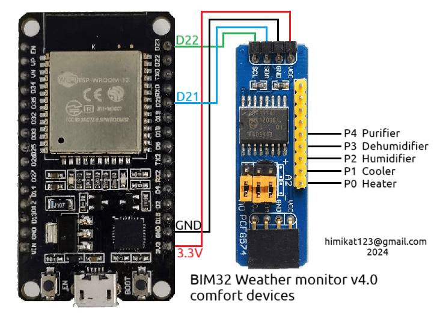</p>

## Схема подключения модуля звука
Чтоб будильник и говорящие часы могли издавать звуки, применен модуль mp3-плеера **DF-Player mini**, схема подключения которого представлена ниже. Необходимо будет скопировать все содержимое папки **[SDcard](https://github.com/himikat123/Weather-monitor-BIM32/tree/master/SDcard)** на **micro-sd карту**, предварительно отформатировав ее в файловую систему FAT32. Если вам не нужен звук - соедините вывод GPIO18 ESP32 с землей.

<p align="center"></p>

Во время эксплуатации данного прибора был обнаружен неприятный момент, данный модуль mp3-плеера издает постоянный негромкий шум. Чтоб избавиться от шума, нужно перепаять резистор из положения А в положение Б, показанный на фото ниже. Данная манипуляция переключает вход MUTE усилителя на выход BUSY, на котором появляется лог. сигнал только во время воспроизведения звука.

<p align="center">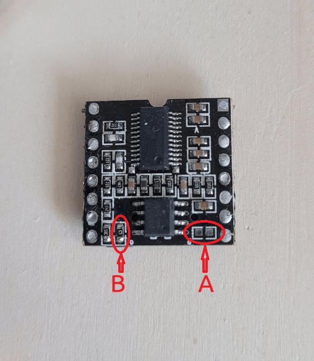</p>


## Схема часов

Ну и, как и обещал, нормальная общая схема для общего развития.
```diff 
- Обратите внимание, если вы решите не устанавливать кнопки 
- (включения/отключения дисплеев и отключения будильника), 
- подтягивающие резисторы этих кнопок все равно нужно установить.
```

<p align="center">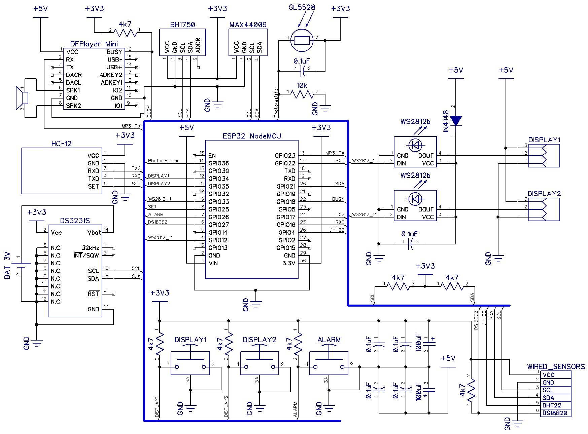</p>

## Прошивка часов

У этих часов нет своей отдельной прошивки. Сюда подходит прошивка от [монитора погоды BIM32](https://github.com/himikat123/Weather-monitor-BIM32)

Для прошивки монитора погоды вам понадобится **micro-USB** кабель и компьютер.

Для прошивки **ESP32**:
1. Скачайте [flash_download_tools](https://www.google.ru/search?q=flash_download_tools)
2. Запустите его, выберите ESP32 DownloadTool
3. Выберите бинарные файлы прошивки (находятся в папке [bin](https://github.com/himikat123/Weather-monitor-BIM32/tree/master/bin)) и адреса как на скриншоте. И номер COM-порта
4. Нажмите кнопку Start в программе прошивки и кнопку Settings прибора (кнопка BOOT на модуле ESP32). Удерживайте кнопку Settings нажатой, пока не начнется прошивка.

<p align="center"></p>

После прошивки **часы** нужно настроить. Ненастроенные часы сами включают точку доступа (создают WiFi сеть) **BIM32** с паролем сети по умолчанию **1234567890**. А в дальнейшем, чтоб ее снова включить, нужно нажать и удерживать нажатой кнопку **Settings**, пока на экране не появится надпись **"AP"** (сокращение от Access Point - Точка Доступа). Подключив ноутбук или телефон к сети **BIM32** нужно открыть браузер и перейти по адресу **http://192.168.4.1**. Введите логин **admin** и пароль **1111**, чтоб открыть страницу настроек. В дальнейшем, в целях безопасности, рекомендуется сменить логин и пароль по умолчанию.

<p align="center"></p>

Также, когда часы уже настроены и подключены к сети, в настройки можно попасть и без нажатия кнопки **Settings**, достаточно ввести в браузере IP-адрес **часов**. Узнать этот адрес можно в вашем роутере, или задать предварительно в настройках часов статический IP адрес.

<hr />

## Демо страницы настроек можно посмотреть <a href="https://himikat123.github.io/Web-Interface-BIM/" target="_blank">здесь</a>

## Фотоинструкция по сборке часов
<p align="center">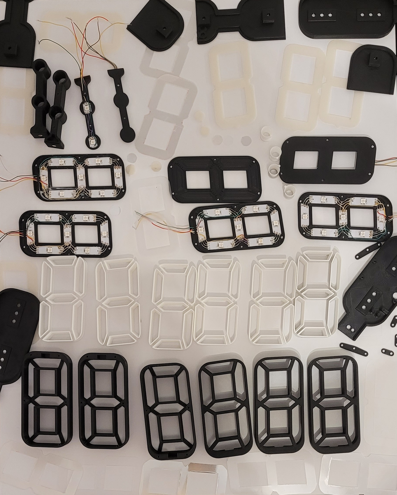</p>

Почти все детали корпуса напечатаны на 3д принтере, файлы для 3д печати вы найдете в папке **STL**.
Исключение составляют рассеивающие пленки, которые я выдрал из разбитого LCD-телевизора. Я просто вырезал ножницами и канцелярским ножом пленки нужной формы.

<p align="center">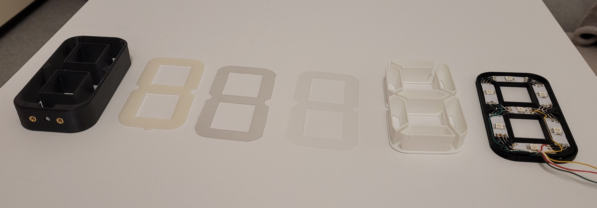</p>

Начнем слева на право. 
  1. В черную рамку вплавляем 2 резьбовые бонки, диаметр резьбы м2.5, длина бонки 3.5мм
  2. Рассеиватель печатаем прозрачным PLA. В положении стоя и включив параметр "Нечеткая оболочка". Чтоб деталь не оторвалась от стола при печати - используйте "Плот"
  3. Рассеивающая пленка выдранная из разбитого ЖК телевизора, или монитора
  4. Вторая рассеивающая пленка 
  5. Отражатель, напечатаный белым платиком
  6. Крышка цифры, с приклеенными светодиодами

<p align="center">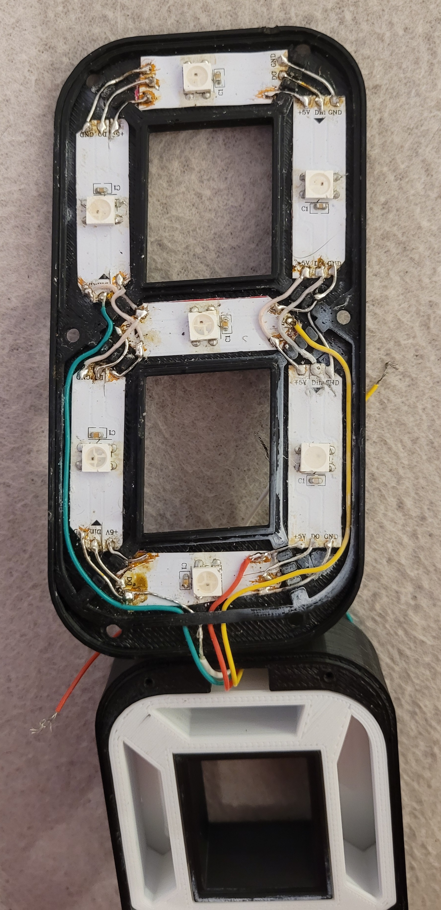</p>

Светодиоды припаиваем отрезками проводов в соответствии со схемой. Для удобства используйте провода разного цвета. Дальнейшая сборка не требует пояснений, на фотографиях все итак видно. Маленькие черные саморезы диаметром 2мм, длинной 10-14мм.

<p align="center">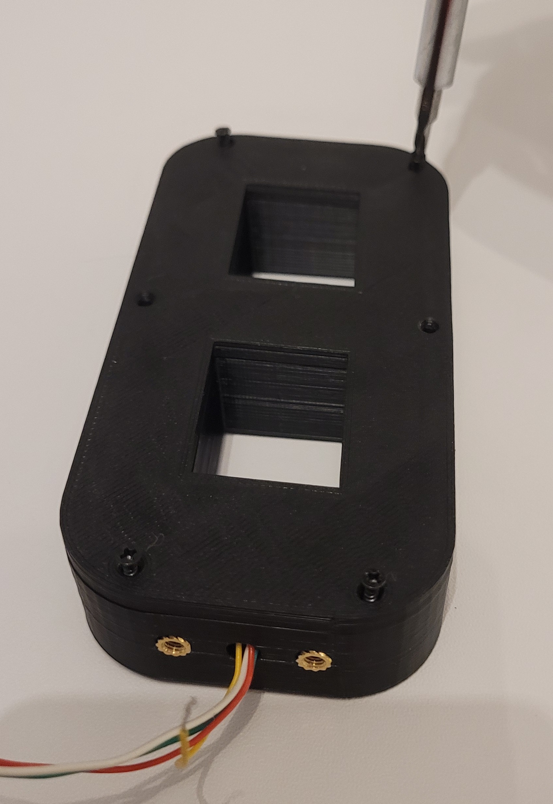</p>

<p align="center">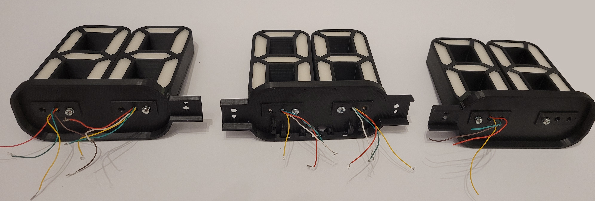</p>

<p align="center">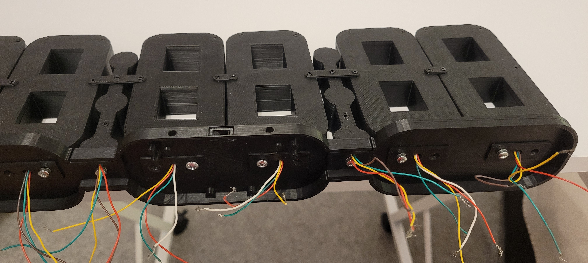</p>

<p align="center">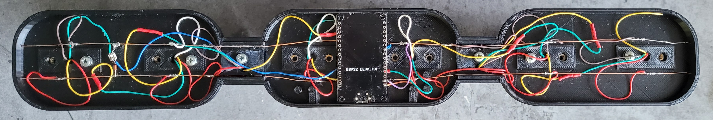</p>

<p align="center">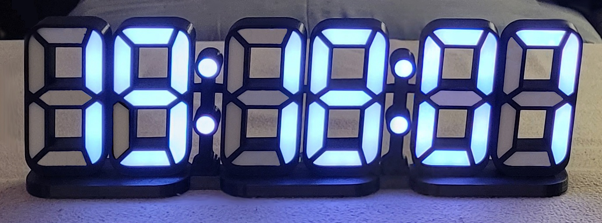</p>

<hr>


## Нравится проект? Купи мне кофе, или пиво.

<a href="https://www.buymeacoffee.com/himikat123Q">
    
</a>

<a href="https://www.paypal.com/donate/?hosted_button_id=R4QDCRKTC9QA6">
    
</a>